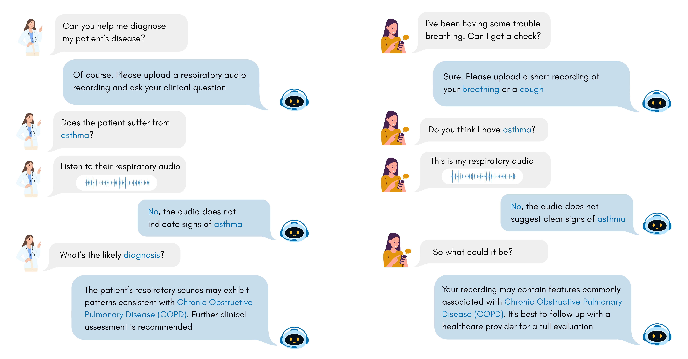

# RA-QA: A Benchmarking System for Respiratory Audio Question Answering Under Real-World Heterogeneity

  

  <b>RA-QA is a large-scale benchmark for Respiratory Audio Question Answering which covers real-world heterogeneity across modalities, devices, and question types</b> 

**Dataset availability.** This repository currently provides a **preview release** of RA-QA.  
> The **full RA-QA collection** (standardized metadata, complete QA files, and the generation pipeline) will be made **publicly available upon acceptance of the RA-QA paper**.
---

## What is RA-QA?

**RA-QA (Respiratory-Audio Question Answering)** is a benchmarking framework and dataset release that turns heterogeneous public respiratory-audio datasets into a **unified multimodal QA collection**.

RA-QA provides:
- a **standardized data generation pipeline** ,
- **format-diverse QA files** (open-ended / multiple-choice / single-verify),
- a **unified evaluation protocol** for both **discriminative** (categorical) and **regression** (continuous) targets.

This benchmark is designed to stress-test models under **real-world heterogeneity**: different datasets, recording conditions/devices, audio modalities (e.g., cough/breath/speech/auscultation), and question intents.

---

## What’s in this repository?

This repo is organized around two deliverables:

1) **Standardized metadata**  
Per-dataset harmonized tables/JSON exposing canonical attributes and provenance.

2) **QA files**  
Generated QA pairs in multiple formats (OE/MC/SV), linked to recordings/subjects.
